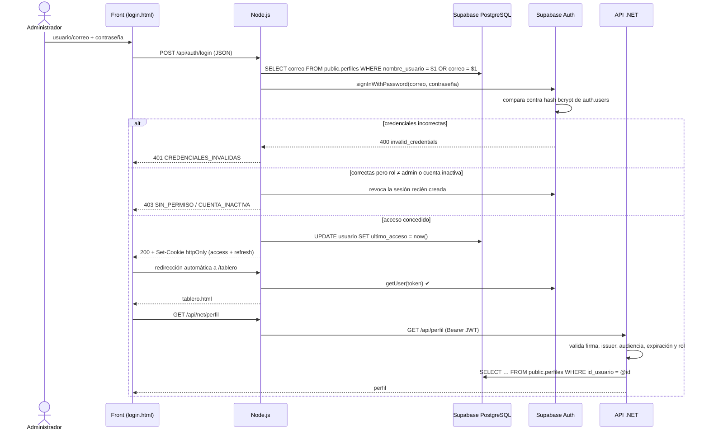

# MarketCar · Panel de control — Sistema de inicio de sesión

Trabajo cuatrimestral de **Bases de Datos Aplicada** (Ingeniería en Sistemas).
Módulo de autenticación que controla el acceso al tablero del administrador del marketplace.

| Capa | Tecnología | Responsabilidad |
|---|---|---|
| Base de datos | **Supabase** (PostgreSQL + Supabase Auth) | Usuarios, contraseñas hasheadas con bcrypt, roles, RLS |
| Backend 1 | **Node.js** (Express) | Login/logout, sesión con cookies httpOnly, sirve el front, puente hacia .NET |
| Backend 2 | **.NET 8** (ASP.NET Core) | API de datos: valida la firma del JWT de Supabase y aplica la política *Administrador* |
| Frontend | **HTML, CSS y JavaScript** (sin frameworks) | Pantalla de login y tablero protegido |

---

## 1. Arquitectura

```
                 cookies httpOnly (mc_at, mc_rt)
┌────────────┐   ─────────────────────────────►   ┌──────────────────────┐   signInWithPassword / getUser   ┌──────────────────┐
│ Navegador  │                                    │   Node.js · Express  │ ───────────────────────────────► │  Supabase Auth   │
│ HTML/CSS/JS│ ◄─────────────────────────────     │   (BFF / gateway)    │                                  │  auth.users      │
└────────────┘          JSON                      │                      │   SQL parametrizado (pg)         │  (hash bcrypt)   │
                                                  │                      │ ───────────────────────────────► ├──────────────────┤
                                                  │                      │                                  │  PostgreSQL      │
                                                  │                      │   Authorization: Bearer <JWT>    │  public.perfiles  │
                                                  │                      │ ──────────┐                      └──────────────────┘
                                                  └──────────────────────┘           │                               ▲
                                                                                     ▼                               │ Npgsql
                                                                         ┌──────────────────────┐                    │
                                                                         │  .NET 8 · ASP.NET    │ ───────────────────┘
                                                                         │  valida firma (JWKS) │
                                                                         └──────────────────────┘
```

**Por qué dos backends.** Supabase Auth es el *proveedor de identidad*: emite un JWT firmado.
Node es el único que habla con el navegador (patrón *Backend for Frontend*) y .NET es una API
de recursos que confía en ese mismo JWT sin compartir sesión ni base de datos de sesiones.
Es el mismo esquema que usaría el marketplace (.NET) y el panel (Node) con un único login.

## 2. Flujo de inicio de sesión



## 3. Cómo cumple cada requisito del enunciado

| Requisito | Implementación |
|---|---|
| Pantalla de login que controla el acceso | `web/publico/login.html`. El tablero (`web/privado/tablero.html`) **no es público**: Node solo lo envía si la sesión es válida (`GET /tablero`). |
| Credenciales verificadas contra una tabla de usuarios en la BD | `auth.users` (credenciales) + `public.perfiles` (perfil y rol), ambas en la base de Supabase. |
| Usuario y contraseña deben corresponder a un usuario registrado | Supabase Auth compara la contraseña; Node además exige que exista el perfil en `public.perfiles`. |
| Contraseña almacenada con un mecanismo de protección | **bcrypt** con sal aleatoria y costo 10 (`crypt(password, gen_salt('bf', 10))`). Nunca texto plano; el script final lo verifica mostrando el prefijo `$2a$10$`. |
| Redirección automática al tablero | El login responde `redirigirA: "/tablero"` y el front hace `location.replace`. Si ya hay sesión, `login.html` redirige solo. |
| Credenciales incorrectas impiden el acceso | 401 con mensaje genérico; `/tablero` sin sesión redirige al login (303) y la API devuelve 401. |
| No requiere historial de sesiones | No se guarda historial; solo `ultimo_acceso` (un campo) para mostrarlo en el tablero. |

## 4. Decisiones de seguridad

- **Tokens en cookies `httpOnly` + `SameSite=Strict`** (y `Secure` en producción): el JavaScript no puede leerlos (mitiga XSS) y otro sitio no puede usarlos (mitiga CSRF). El front nunca toca el JWT.
- **Mensaje de error genérico** ("Usuario o contraseña incorrectos") para usuario inexistente y contraseña errónea, y se consulta a Supabase igual aunque el usuario no exista → no se pueden enumerar cuentas por el mensaje ni por el tiempo de respuesta.
- **Límite de intentos**: 10 fallidos por IP cada 15 minutos (`express-rate-limit`), además del límite propio de Supabase.
- **Autorización por rol**: solo `rol = 'admin'` entra al panel. El rol se relee de la base en cada request (si se le quita el permiso a alguien, lo pierde al instante) y además viaja firmado en el JWT (`app_metadata.rol`) para que .NET autorice sin consultar la base.
- **Sesión renovable**: si el access token (1 h) venció pero el refresh token es válido, Node renueva la sesión de forma transparente.
- **Logout real**: revoca el refresh token en Supabase y borra las cookies.
- **Validación de entrada** con `zod`, body máximo 10 KB, consultas SQL **parametrizadas**.
- **Cabeceras de seguridad** con `helmet` (incluye Content-Security-Policy: el front no usa scripts inline).
- **RLS** en `public.perfiles`: con la *anon key* nadie puede listar usuarios; cada usuario ve su fila y el admin ve todas.
- **Secretos fuera del código**: `.env` (Node) y `dotnet user-secrets` (.NET), ambos en `.gitignore`.
- **.NET sin CORS**: solo lo llama el servidor Node.

## 5. Estructura

```
BDAplicada_Proyecto/
├── database/
│   └── 01_auth_usuarios.sql        Tabla usuario, rol, bcrypt, trigger → JWT, RLS y usuarios iniciales
├── api-node/                       Node.js · Express
│   ├── .env.example
│   └── src/
│       ├── server.js               Arranque y cierre ordenado
│       ├── app.js                  Middlewares, rutas y páginas
│       ├── config.js               Variables de entorno validadas (fail fast)
│       ├── db.js                   Pool de PostgreSQL
│       ├── supabase.js             Cliente de Supabase Auth (uno por operación)
│       ├── errores.js              Errores de negocio con código estable
│       ├── repositorios/usuario.repositorio.js
│       ├── servicios/auth.servicio.js     Lógica de login / verificación / logout
│       ├── middlewares/            cookies, requiereSesion, errores y log
│       └── rutas/                  /api/auth/*  y  /api/net/* (puente a .NET)
├── api-dotnet/MarketCar.Api/       .NET 8 · ASP.NET Core
│   ├── Program.cs
│   ├── Autenticacion/              Validación del JWT de Supabase (JWKS o HS256) y política Administrador
│   ├── Datos/UsuarioRepositorio.cs Npgsql (ADO.NET)
│   ├── Controllers/                PerfilController (protegido) y SaludController
│   └── Modelos/PerfilDto.cs
└── web/
    ├── publico/                    login.html, css/, js/, img/  (archivos estáticos)
    └── privado/tablero.html        Solo se entrega con sesión válida
```

### Endpoints

| Método | Ruta | Servicio | Protección | Descripción |
|---|---|---|---|---|
| POST | `/api/auth/login` | Node | límite de intentos | `{ usuario, password }` → cookies de sesión |
| POST | `/api/auth/logout` | Node | — | Revoca la sesión y borra cookies |
| GET | `/api/auth/sesion` | Node | sesión admin | Perfil del usuario logueado |
| GET | `/tablero` | Node | sesión admin | Página del tablero (si no, 303 → login) |
| * | `/api/net/*` | Node → .NET | sesión admin | Reenvía a `.NET /api/*` con el JWT |
| GET | `/api/perfil` | .NET | JWT + política Administrador | Perfil leído con Npgsql |
| GET | `/api/salud` | .NET | pública | Estado de la API y de la base |

Códigos de error que devuelve Node: `CREDENCIALES_INVALIDAS` (401), `SESION_INVALIDA` (401),
`SIN_PERMISO` (403), `CUENTA_INACTIVA` (403), `DEMASIADOS_INTENTOS` (429), `DATOS_INVALIDOS` (400),
`AUTH_NO_DISPONIBLE` (503), `API_NET_NO_DISPONIBLE` (502).

## 6. Cómo ejecutarlo

**Requisitos:** Node.js 20+ (recomendado 22 LTS), .NET SDK 8, un proyecto de Supabase.

### 6.1 Base de datos
1. Supabase → **SQL Editor** → pegar y ejecutar `database/01_auth_usuarios.sql`.
2. La última consulta debe mostrar los dos usuarios con `hash_bcrypt = $2a$10$…`.

### 6.2 Node.js
```bash
cd api-node
cp .env.example .env        # en Windows: copy .env.example .env
# completar SUPABASE_URL, SUPABASE_ANON_KEY (Project Settings → API)
# y DATABASE_URL (Connect → Session pooler)
npm install
npm start                    # http://localhost:3000
```

### 6.3 .NET
```bash
cd api-dotnet/MarketCar.Api
dotnet user-secrets set "Supabase:Url" "https://TU-PROYECTO.supabase.co"
dotnet user-secrets set "ConnectionStrings:Supabase" "Host=aws-0-sa-east-1.pooler.supabase.com;Port=5432;Database=postgres;Username=postgres.TU-PROYECTO;Password=TU-PASSWORD;SSL Mode=Require"
dotnet run                   # http://localhost:5080
```
> **Claves JWT:** los proyectos nuevos de Supabase firman con claves asimétricas y .NET las
> descarga solas de `…/auth/v1/.well-known/jwks.json`. Si tu proyecto todavía usa el
> *Legacy JWT secret* (Project Settings → JWT Keys), cargalo también:
> `dotnet user-secrets set "Supabase:JwtSecret" "<secreto>"`.

### 6.4 Probar
Abrir **http://localhost:3000**.

| Caso | Usuario | Contraseña | Resultado esperado |
|---|---|---|---|
| Administrador | `admin` o `admin@marketcar.com` | `Admin123!` | Entra al tablero; las dos tarjetas en verde |
| Contraseña incorrecta | `admin` | cualquier otra | "Usuario o contraseña incorrectos." |
| Usuario inexistente | `noexiste` | cualquiera | Mismo mensaje genérico |
| Cuenta sin permiso | `capital.motors` | `Vendedor123!` | "Tu cuenta no tiene permiso…" (403) |
| Acceso directo sin login | — | — | `/tablero` redirige al login |
| 11 intentos fallidos | `admin` | mal | "Demasiados intentos…" (429) |

Para crear más usuarios desde SQL:
```sql
select public.crear_usuario('nuevo@marketcar.com', 'Clave1234!', 'nuevo', 'Nuevo Admin', 'administrador', 'admin');
```
